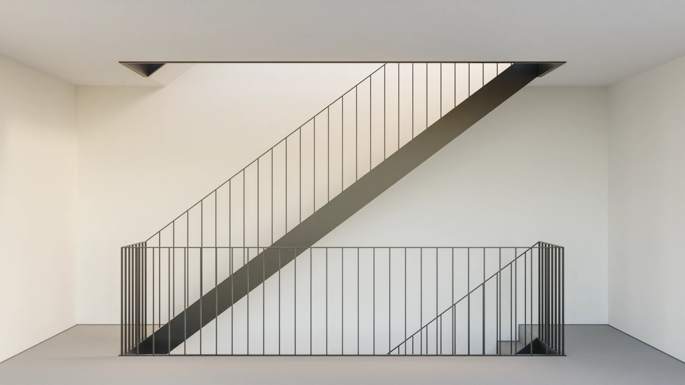

# Railing Nodes

Blender Geometry Nodes to generate a simple railing along the edges of a mesh.

Download: [railing-nodes.blend](https://github.com/balazsfekete/railing-nodes/raw/main/railing-nodes.blend)

### Settings

-   `Height` - Change the height of the railing.
-   `Width` - Change the width of the railing. It is centred to the edges of the input mesh.
-   `Thickness` - Change the thickness of the handrail and spindles.
-   `Spacing` - Set the maximum horizontal distance between spindles.

---

_Made with Blender 3.2.0_
